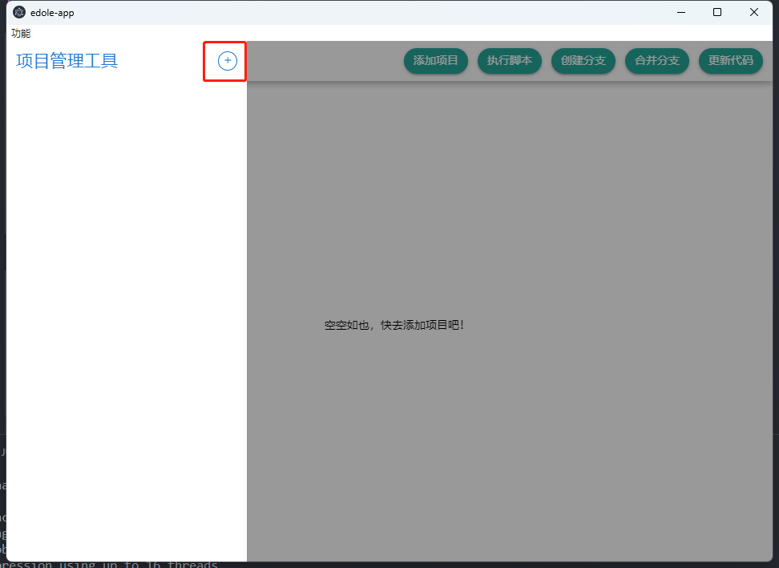
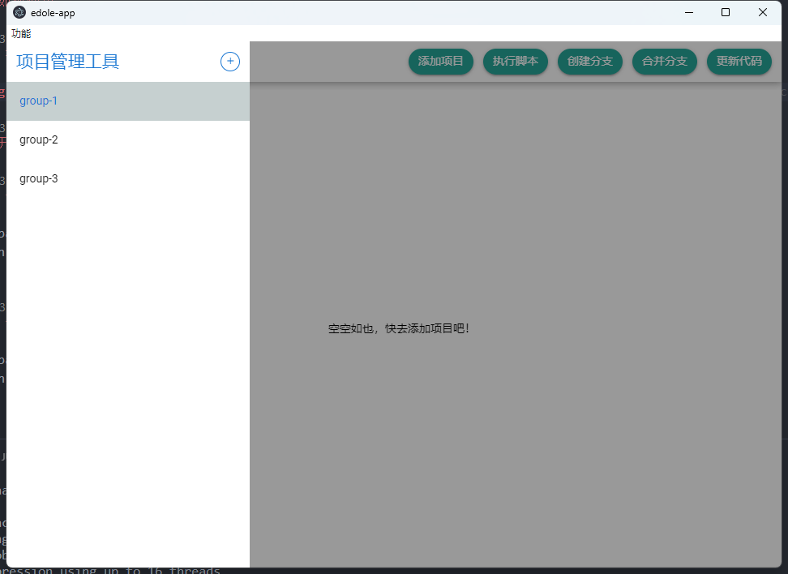
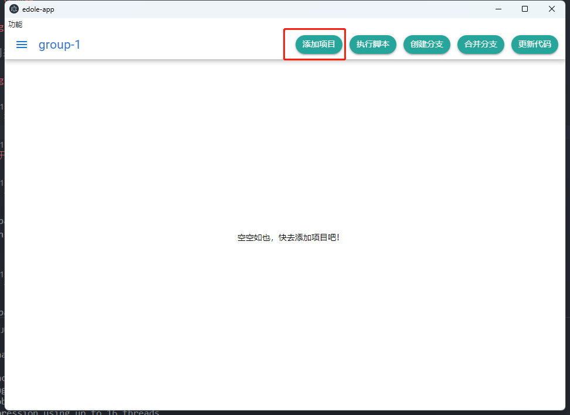
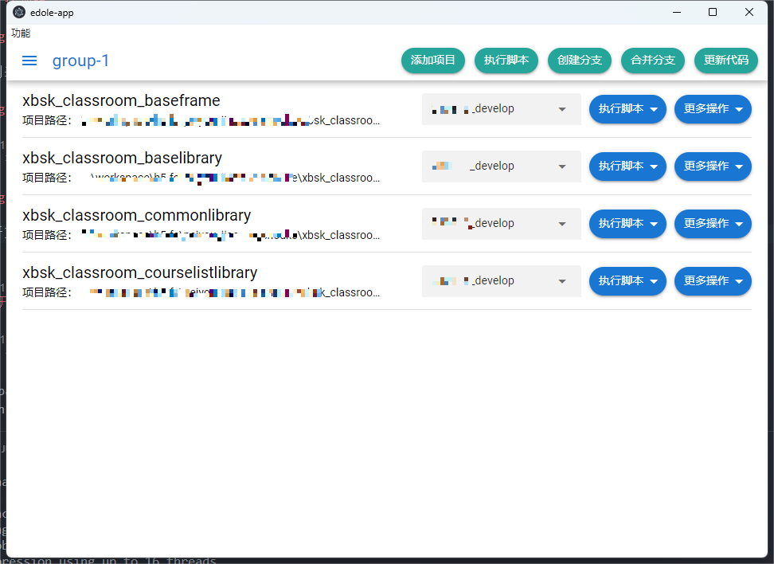

# edole-app (edole-app)

高效开发授课端（Efficient development of lecturer end）

## 功能特色

基于 Electron + quasar + Vite + Vue3 开发，多项目管理工具。多平台支持。

**功能:**

:airplane: 项目分组，清晰管理。

:airplane: 可视化管理分支，一键创建、合并分支、更新代码。

:airplane: 基于 nodejs 执行 scripts。支持批处理，可视化观察执行进度。

**未来计划:**

:soon: 支持用户自定义一键配置脚本。

:soon: 支持可视化查看 git status; 支持 commit/push

## 如何使用

### 添加组



组列表



### 项目

#### 在组内添加项目



打开文件夹选择器，支持多选。

### 项目列表和功能



批量执行项目功能和单项目执行功能。

## 开发与构建

### 安装环境配置

```bash
yarn
```

### 开发模式启动应用程序

```bash
yarn dev
```

### 构建并生成当前系统安装包

```bash
yarn build
```
